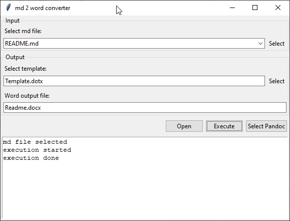

# md2word

Convert markdown documents into a Microsoft Word document using Pandoc.

If you are not familiar with Markdown, I recommend visiting the website [Markdown guide](https://www.markdownguide.org). 

If you are not familiar with Pandoc, I recommend visiting the website [Pandoc](https://pandoc.org).

# Installation

If you like git use command in your prefered folder: 

	git clone https://github.com/marconaccini/md2word.git
	
Otherwise download the zip and extract content in your prefered folder

If you like create e venv enviroment like this:

	python -m venv env
	
and then activate the enviroment with:

Linux:

	source env/bin/activate
	
Windows: 

	env\Scripts\activate.bat

Than in that folder run this command:

	pip install -r requirements.txt	

# Other requirements  

md2word needs to run with python3 and pandoc.

# How to run  

Into windows:

	py md2word2.py
	
	
into linux 	

	python3 ./md2word2.py
	
	
